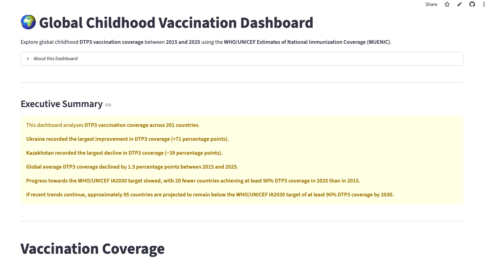

# Childhood Vaccination Dashboard

An interactive Streamlit dashboard that explores global childhood DTP3 vaccination coverage between 2015 and 2025 using the WHO/UNICEF Estimates of National Immunization Coverage (WUENIC).

🌐 **Live Demo:** [https://your-streamlit-link.streamlit.app](https://vaccinationdashboard-e7cbmdglaht3r9lms7vfgc.streamlit.app/)

---

## Overview

This dashboard allows users to analyse childhood vaccination coverage across countries and over time. It provides interactive visualisations to compare vaccination rates, identify trends, and explore differences between countries.

The project was built to demonstrate skills in data cleaning, exploratory data analysis, dashboard design, and interactive visualisation using Python.

---

## Features

- 🌍 Interactive global vaccination dashboard
- 📈 Vaccination trends over time
- 🌎 Country comparisons
- 📊 Global averages
- 📉 Most improved and most declined countries
- 🎛 Interactive filters for countries and vaccines

---

## Dashboard Preview



---

## Dataset

**Source:** WHO & UNICEF Estimates of National Immunization Coverage (WUENIC)

The dataset contains childhood vaccination coverage estimates for countries around the world across multiple years.

---

## Technologies Used

- Python
- Streamlit
- Pandas
- Plotly
- NumPy

---

## Repository Structure

```
VaccinationDashboard/
│
├── app.py
├── requirements.txt
├── data/
│   └── Cleaned_WUENIC.csv
├── screenshots/
│   └── dashboard.png
└── README.md
```

---

## Run Locally

```bash
git clone https://github.com/micoleolivia/VaccinationDashboard.git

cd VaccinationDashboard

pip install -r requirements.txt

streamlit run app.py
```

---

## Author

**Micole Dmochowska**

Actuarial Science student with an interest in data analytics, healthcare analytics, machine learning, and interactive dashboards.
